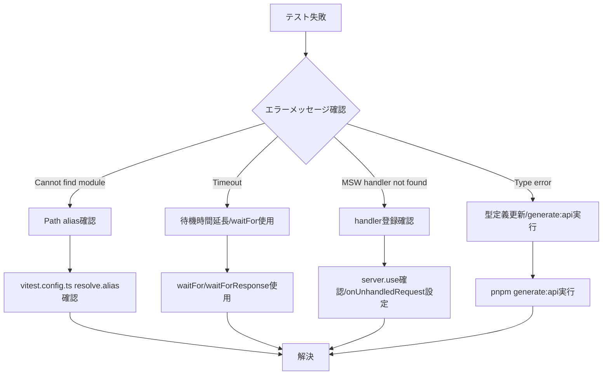

# React/Spring API テスト自動化 包括ガイド

## はじめに

本ドキュメントは、React (Next.js 15 App Router) フロントエンドと Spring Boot バックエンドを対象とした、テスト自動化の包括的な実践ガイドです。ISTQB Advanced Level Test Automation Engineer の知識体系をベースに、現代的な技術スタックに最適化した内容となっています。

### 対象読者

- フロントエンド開発者（React/Next.js/TypeScript）
- バックエンド開発者（Spring Boot/Java）
- テスト自動化エンジニア
- プロジェクトリーダー・テックリード

### 本ガイドで扱う内容

- テスト自動化の基本概念と目的
- 技術スタック別のテスト戦略
- 段階的な導入手順とベストプラクティス
- 継続的改善とメンテナンス手法

---

## 第1章: テスト自動化の概要と目的

### 1.1 テスト自動化とは

テスト自動化とは、専用のソフトウェアツールを使用して、テストの実行、結果の比較、環境のセットアップを自動的に行うことを指します。本プロジェクトでは、以下のツール群を使用します。

#### 採用技術スタック

| レイヤー | 技術 | バージョン | 用途 |
|---------|------|-----------|------|
| **テストランナー** | Vitest | ^4.x | ユニット・統合テスト |
| **E2Eテスト** | Playwright | ^1.49+ | ブラウザ自動化テスト |
| **UI検証/ドキュメント** | Storybook | ^10.x | コンポーネント開発・テスト |
| **APIモック** | MSW | ^2.x | API応答シミュレーション |
| **DOMテスト** | @testing-library/react | ^16.x | ユーザー視点テスト |
| **アクセシビリティ** | vitest-axe | latest | WCAG自動検証 |
| **テストデータ生成** | @faker-js/faker | latest | ダミーデータ生成 |
| **契約管理** | OpenAPI + orval | latest | 型・スキーマ自動生成 |

### 1.2 テスト自動化の目的

プロジェクトにおけるテスト自動化の主な目的は以下の通りです。

#### 主要な目的

1. **テスト効率の向上**
   - 手動テスト: 8時間（3名体制）→ 自動テスト: 15分（CI上で実行）
   - 回帰テストの実行頻度を週1回から1日複数回に増加

2. **機能カバレッジの拡大**
   - コードカバレッジ目標: 80%以上
   - API契約違反の即座検出

3. **総テストコストの削減**
   - 初期投資: 約40時間（環境構築＋トレーニング）
   - ROI達成期間: 約3スプリント後

4. **品質フィードバックの迅速化**
   - PR作成時点で自動テスト実行
   - マージ前に問題検出・修正

### 1.3 テスト自動化の利点と制限

#### 利点

```typescript
// ✅ メリット例: API契約変更の即座検知
// OpenAPI仕様更新 → orval自動生成 → 型エラー検出 → PR段階で修正

// Before: 手動テスト
// - API変更に気付かず本番デプロイ
// - ユーザー影響が発生してから気付く

// After: 自動テスト
// - CI段階で型エラー検出
// - マージ前に修正完了
```

**具体的な利点:**

- ビルドごとのテスト実行数増加（500+テストを15秒で実行）
- OpenAPI契約変更の自動検知
- MSWによるAPI依存排除とテスト高速化
- Storybook Interaction Testsによる操作回帰の早期検出
- Visual Regression（Chromatic等）による見た目差分検出
- 並列実行による実行時間短縮（Playwright sharding）

#### 制限事項

テスト自動化では以下のことができません。

```typescript
// ❌ 自動化できないテスト例

// 1. 探索的テスト
// - 予期しないバグの発見
// - UXの総合的評価

// 2. 視覚的な美しさの判断
// - デザインの美的センス評価
// - ブランドイメージの適合性

// 3. 実際のネットワーク条件
// - MSWは理想的な応答のみシミュレート
// - 実際のタイムアウト・ネットワーク遅延は別途E2Eで検証必要

// 4. Server Actionsの完全な検証
// - Storybook では限定的
// - Playwright E2Eでのみ完全テスト可能
```

### 1.4 テスト自動化の成功要因

#### 要因1: テスト自動化アーキテクチャ（TAA）

プロジェクトでは以下のレイヤー構造でTAAを構築します。

```typescript
/**
 * テスト自動化アーキテクチャ（gTAA）
 * 
 * テスト生成レイヤー
 *   ↓ OpenAPI → orval → zod schema + react-query hooks
 * テスト定義レイヤー
 *   ↓ Storybook Stories + Vitest Test Cases
 * テスト実行レイヤー
 *   ↓ Vitest Runner + Playwright Runner
 * テスト適合レイヤー
 *   ↓ MSW Handlers + Testing Library Queries
 */
```

#### 要因2: テスト可能な設計

```typescript
// ✅ 良い例: テスト可能な設計
export interface UserCardProps {
  userId: string;
  onDelete?: (id: string) => void;
}

export const UserCard = ({ userId, onDelete }: UserCardProps) => {
  const { data, isLoading, error } = useUser(userId); // react-query hook
  
  if (isLoading) return <Skeleton data-testid="user-card-loading" />;
  if (error) return <ErrorMessage error={error} />;
  if (!data) return null;
  
  return (
    <Card data-testid={`user-card-${userId}`}>
      <CardHeader>
        <CardTitle>{data.name}</CardTitle>
      </CardHeader>
      <CardContent>
        <p>{data.email}</p>
        {onDelete && (
          <Button 
            onClick={() => onDelete(data.id)}
            aria-label="ユーザーを削除"
          >
            削除
          </Button>
        )}
      </CardContent>
    </Card>
  );
};
```

```typescript
// ❌ 悪い例: テスト困難な設計
export const UserCard = () => {
  const [user, setUser] = useState(null);
  
  useEffect(() => {
    // fetch直書き - モック困難
    fetch('/api/user').then(r => r.json()).then(setUser);
  }, []);
  
  // data-testid なし、aria-label なし
  return user ? <div>{user.name}</div> : null;
};
```

#### 要因3: テスト自動化戦略

プロジェクトでは**テストトロフィー**戦略を採用します。

```
テストトロフィー
┌─────────────────────────────────────────────────────────────┐
│ E2E Tests                                                   │ ← 少数（5-10 Critical Paths）
├─────────────────────────────────────────────────────────────┤
│ Integration / Interaction Tests                             │ ← 中心（主要ユースケース）
├─────────────────────────────────────────────────────────────┤
│ Unit / Component Tests                                      │ ← 補完（ロジック・UI部品）
├─────────────────────────────────────────────────────────────┤
│ Static Analysis                                             │ ← 常時実行（TypeScript + ESLint）
└─────────────────────────────────────────────────────────────┘
```

| テスト種別 | ツール | カバレッジ目標 | 実行環境 |
|----------|--------|--------------|---------|
| **Static** | TypeScript + ESLint | 100% | IDE + CI |
| **Unit Tests** | Vitest | 75%+ | Node.js |
| **Component / Integration Tests** | Vitest + Testing Library + MSW | 85%+ | jsdom |
| **Interaction Tests** | Storybook play function + `test-storybook` | 主要フロー | Chromium（Storybook iframe） |
| **E2E Tests** | Playwright | 5-10 Critical Paths | 実ブラウザ |
| **Visual Regression** | Storybook + Chromatic（またはVRT） | 主要UI | クラウドまたはChromium |
| **Accessibility** | vitest-axe | 全Component | jsdom |

---

## 第2章: テスト自動化の準備

### 2.1 プロジェクト構成の理解

#### 推奨ディレクトリ構造

```bash
project-root/
├── apps/
│   └── web/                    # Next.js アプリケーション
│       ├── src/
│       │   ├── app/            # App Router
│       │   ├── components/     # React Components
│       │   │   └── UserCard/
│       │   │       ├── UserCard.tsx
│       │   │       ├── UserCard.test.tsx      # Vitest
│       │   │       └── UserCard.stories.tsx   # Storybook
│       │   ├── lib/            # ユーティリティ
│       │   └── tests/          # テスト共通設定
│       │       ├── setup.ts           # Vitest setup
│       │       ├── factories/         # テストデータFactory
│       │       │   ├── userFactory.ts
│       │       │   └── orderFactory.ts
│       │       └── msw/               # MSW設定
│       │           ├── server.ts      # Node.js用
│       │           ├── browser.ts     # Browser用
│       │           └── handlers/      # APIハンドラー
│       │               ├── userHandlers.ts
│       │               └── orderHandlers.ts
│       ├── e2e/                # Playwright E2E
│       │   ├── tests/
│       │   │   └── user-registration.spec.ts
│       │   └── pages/          # Page Object Model
│       │       └── LoginPage.ts
│       ├── .storybook/         # Storybook設定
│       ├── vitest.config.ts
│       └── playwright.config.ts
└── packages/
    ├── api-client/             # OpenAPI生成コード
    ├── test-utils/             # 共通テストユーティリティ
    └── ui/                     # 共通UIコンポーネント
```

### 2.2 開発環境のセットアップ

#### 必須ツールのインストール

```bash
# 1. Node.js 環境確認（最低: v18.x / 推奨: v20.x以上）
node --version

# 2. pnpm インストール（グローバル）
npm install -g pnpm@9

# 3. プロジェクト依存関係インストール
pnpm install

# 3.1 Storybook Interaction Tests（CLI）を使う場合
pnpm add -D @storybook/test-runner

# 4. Playwright ブラウザインストール（設定に合わせて全ブラウザ）
pnpm exec playwright install

# Chromiumのみで運用する場合
# pnpm exec playwright install chromium
```

#### Vitest 設定

```typescript title="vitest.config.ts"
import { defineConfig } from 'vitest/config';
import react from '@vitejs/plugin-react';
import path from 'path';

export default defineConfig({
  plugins: [react()],
  test: {
    globals: true,
    environment: 'jsdom',
    setupFiles: ['./src/tests/setup.ts'],
    coverage: {
      provider: 'v8',
      reporter: ['text', 'json', 'html', 'lcov'],
      include: ['src/**/*.{ts,tsx}'],
      exclude: [
        '**/*.stories.tsx',
        '**/*.test.tsx',
        '**/types/**',
        '**/tests/**',
      ],
      thresholds: {
        lines: 80,
        functions: 80,
        branches: 75,
        statements: 80,
      },
    },
    pool: 'threads',
    poolOptions: {
      threads: {
        singleThread: false,
        maxThreads: 8,
      },
    },
  },
  resolve: {
    alias: {
      '@': path.resolve(__dirname, './src'),
    },
  },
});
```

#### Vitest セットアップファイル

```typescript title="src/tests/setup.ts"
import '@testing-library/jest-dom';
import { cleanup } from '@testing-library/react';
import { afterEach, beforeAll, afterAll, vi } from 'vitest';
import { server } from './msw/server';

// MSW サーバー起動
beforeAll(() => {
  server.listen({ onUnhandledRequest: 'error' });
});

// 各テスト後にクリーンアップ
afterEach(() => {
  cleanup();
  server.resetHandlers();
});

// MSW サーバー停止
afterAll(() => {
  server.close();
});

// 環境変数モック
vi.mock('next/navigation', () => ({
  useRouter: () => ({
    push: vi.fn(),
    replace: vi.fn(),
    prefetch: vi.fn(),
  }),
  useSearchParams: () => new URLSearchParams(),
  usePathname: () => '/',
}));
```

#### Playwright 設定

```typescript title="playwright.config.ts"
import { defineConfig, devices } from '@playwright/test';

export default defineConfig({
  testDir: './e2e/tests',
  fullyParallel: true,
  forbidOnly: !!process.env.CI,
  retries: process.env.CI ? 2 : 0,
  workers: process.env.CI ? 4 : undefined,
  reporter: [
    ['html', { open: 'never' }],
    ['json', { outputFile: 'test-results/results.json' }],
    ['junit', { outputFile: 'test-results/junit.xml' }],
  ],
  use: {
    baseURL: process.env.BASE_URL || 'http://localhost:3000',
    trace: 'on-first-retry',
    screenshot: 'only-on-failure',
    video: 'retain-on-failure',
  },
  projects: [
    {
      name: 'chromium',
      use: { ...devices['Desktop Chrome'] },
    },
    {
      name: 'firefox',
      use: { ...devices['Desktop Firefox'] },
    },
    {
      name: 'webkit',
      use: { ...devices['Desktop Safari'] },
    },
  ],
  webServer: {
    command: 'pnpm dev',
    url: 'http://localhost:3000',
    reuseExistingServer: !process.env.CI,
  },
});
```

#### Storybook 設定

```typescript title=".storybook/main.ts"
import type { StorybookConfig } from '@storybook/nextjs';

const config: StorybookConfig = {
  stories: ['../src/**/*.stories.@(js|jsx|ts|tsx|mdx)'],
  addons: [
    '@storybook/addon-essentials',
    '@storybook/addon-interactions',
    '@storybook/addon-a11y',
    '@storybook/addon-vitest',
  ],
  framework: {
    name: '@storybook/nextjs',
    options: {},
  },
  docs: {
    autodocs: 'tag',
  },
  staticDirs: ['../public'],
};

export default config;
```

`@storybook/addon-vitest` はStorybook UI内での検証体験向上に使用し、CIでのplay関数実行は `storybook:test`（`test-storybook`）に分離します。

```typescript title=".storybook/preview.tsx"
import type { Preview } from '@storybook/react';
import { initialize, mswLoader } from 'msw-storybook-addon';
import { handlers } from '../src/tests/msw/handlers';

// MSW 初期化
initialize({
  onUnhandledRequest: 'warn',
});

const preview: Preview = {
  parameters: {
    msw: {
      handlers: handlers,
    },
    actions: { argTypesRegex: '^on[A-Z].*' },
    controls: {
      matchers: {
        color: /(background|color)$/i,
        date: /Date$/,
      },
    },
  },
  loaders: [mswLoader],
};

export default preview;
```

### 2.3 OpenAPI契約駆動開発のセットアップ

#### orval 設定

```typescript title="orval.config.ts"
import { defineConfig } from 'orval';

export default defineConfig({
  api: {
    input: {
      target: './openapi.yaml', // または Spring側から取得
    },
    output: {
      mode: 'tags-split',
      target: './src/api/generated',
      client: 'react-query',
      mock: false,
      override: {
        mutator: {
          path: './src/lib/httpClient.ts',
          name: 'httpClient',
        },
      },
    },
    hooks: {
      afterAllFilesWrite: 'prettier --write',
    },
  },
});
```

#### 自動生成コマンド

```json title="package.json"
{
  "scripts": {
    "generate:api": "orval --config orval.config.ts",
    "dev": "next dev",
    "test": "vitest",
    "test:run": "vitest run",
    "test:ui": "vitest --ui",
    "test:coverage": "vitest run --coverage",
    "test:report:json": "vitest run --reporter=default --reporter=json --outputFile=test-results/vitest-results.json",
    "test:e2e": "playwright test",
    "test:e2e:ui": "playwright test --ui",
    "test:e2e:headed": "playwright test --headed",
    "test:e2e:debug": "playwright test --debug",
    "storybook": "storybook dev -p 6006",
    "build-storybook": "storybook build",
    "storybook:test": "test-storybook",
    "storybook:coverage": "test-storybook --coverage"
  }
}
```

### 2.4 MSW（Mock Service Worker）のセットアップ

#### MSW サーバー設定（Node.js用）

```typescript title="src/tests/msw/server.ts"
import { setupServer } from 'msw/node';
import { handlers } from './handlers';

export const server = setupServer(...handlers);
```

#### MSW ブラウザ設定（開発環境用）

```typescript title="src/tests/msw/browser.ts"
import { setupWorker } from 'msw/browser';
import { handlers } from './handlers';

export const worker = setupWorker(...handlers);
```

#### ハンドラー統合

```typescript title="src/tests/msw/handlers/index.ts"
import { userHandlers } from './userHandlers';
import { orderHandlers } from './orderHandlers';
import { authHandlers } from './authHandlers';

export const handlers = [
  ...authHandlers,
  ...userHandlers,
  ...orderHandlers,
];
```

#### ユーザーハンドラー例

```typescript title="src/tests/msw/handlers/userHandlers.ts"
import { http, HttpResponse } from 'msw';
import { userFactory } from '../../factories/userFactory';

export const userHandlers = [
  // GET /api/users/:id
  http.get('/api/users/:id', ({ params }) => {
    const user = userFactory.build({ 
      id: params.id as string 
    });
    return HttpResponse.json(user);
  }),

  // POST /api/users
  http.post('/api/users', async ({ request }) => {
    const body = await request.json();
    const user = userFactory.build(body);
    return HttpResponse.json(user, { status: 201 });
  }),

  // PUT /api/users/:id
  http.put('/api/users/:id', async ({ params, request }) => {
    const body = await request.json();
    const user = userFactory.build({ 
      id: params.id as string,
      ...body 
    });
    return HttpResponse.json(user);
  }),

  // DELETE /api/users/:id
  http.delete('/api/users/:id', () => {
    return new HttpResponse(null, { status: 204 });
  }),
];
```

### 2.5 Factory パターンによるテストデータ生成

#### Factory 基本実装

```typescript title="src/tests/factories/userFactory.ts"
import { faker } from '@faker-js/faker';

// Seed固定で決定的なテストデータ生成
faker.seed(123);

export interface User {
  id: string;
  name: string;
  email: string;
  role: 'user' | 'admin';
  createdAt: string;
}

export const userFactory = {
  build: (overrides?: Partial<User>): User => ({
    id: faker.string.uuid(),
    name: faker.person.fullName(),
    email: faker.internet.email(),
    role: 'user',
    createdAt: faker.date.past().toISOString(),
    ...overrides,
  }),

  buildList: (count: number, overrides?: Partial<User>): User[] => {
    return Array.from({ length: count }, () => userFactory.build(overrides));
  },

  buildAdmin: (overrides?: Partial<User>): User => {
    return userFactory.build({ role: 'admin', ...overrides });
  },
};
```

#### Factory 使用例

```typescript title="src/components/UserCard/UserCard.test.tsx"
import { describe, test, expect } from 'vitest';
import { render, screen } from '@testing-library/react';
import { userFactory } from '@/tests/factories/userFactory';
import { UserCard } from './UserCard';

describe('UserCard', () => {
  test('ユーザー名とメールアドレスを表示する', () => {
    const user = userFactory.build({ 
      name: 'Alice Johnson',
      email: 'alice@example.com' 
    });

    render(<UserCard user={user} />);

    expect(screen.getByText('Alice Johnson')).toBeInTheDocument();
    expect(screen.getByText('alice@example.com')).toBeInTheDocument();
  });

  test('管理者バッジを表示する', () => {
    const admin = userFactory.buildAdmin();

    render(<UserCard user={admin} />);

    expect(screen.getByText('管理者')).toBeInTheDocument();
  });
});
```

---

## 第3章: テストの実装パターン

### 3.1 ユニットテスト（Pure Functions）

純粋関数やユーティリティ関数のテストです。最も高速で、最も多く書くべきテストです。

```typescript title="src/lib/utils.ts"
/**
 * 配列の合計値を計算する
 */
export function calculateTotal(numbers: number[]): number {
  return numbers.reduce((sum, num) => sum + num, 0);
}

/**
 * 金額をフォーマットする
 */
export function formatCurrency(amount: number): string {
  return new Intl.NumberFormat('ja-JP', {
    style: 'currency',
    currency: 'JPY',
  }).format(amount);
}
```

```typescript title="src/lib/utils.test.ts"
import { describe, test, expect } from 'vitest';
import { calculateTotal, formatCurrency } from './utils';

describe('calculateTotal', () => {
  test('正の数値の合計を正しく計算する', () => {
    expect(calculateTotal([1, 2, 3, 4, 5])).toBe(15);
  });

  test('負の数値を含む合計を正しく計算する', () => {
    expect(calculateTotal([10, -5, 3])).toBe(8);
  });

  test('空配列の場合は0を返す', () => {
    expect(calculateTotal([])).toBe(0);
  });

  test('小数点を含む数値の合計を正しく計算する', () => {
    expect(calculateTotal([0.1, 0.2, 0.3])).toBeCloseTo(0.6);
  });
});

describe('formatCurrency', () => {
  test('正の金額を正しくフォーマットする', () => {
    expect(formatCurrency(1000)).toBe('¥1,000');
  });

  test('0円を正しくフォーマットする', () => {
    expect(formatCurrency(0)).toBe('¥0');
  });

  test('負の金額を正しくフォーマットする', () => {
    expect(formatCurrency(-500)).toBe('-¥500');
  });
});
```

### 3.2 コンポーネントテスト（Vitest + Testing Library）

React Componentの単体テストです。MSWでAPIをモックし、ユーザー操作をシミュレートします。

```typescript title="src/components/UserCard/UserCard.tsx"
import { Card, CardHeader, CardTitle, CardContent } from '@/components/ui/card';
import { Button } from '@/components/ui/button';
import { useUser } from '@/api/queries/userQueries';
import { Skeleton } from '@/components/ui/skeleton';
import { ErrorMessage } from '@/components/ErrorMessage';

export interface UserCardProps {
  userId: string;
  onDelete?: (id: string) => void;
}

export const UserCard = ({ userId, onDelete }: UserCardProps) => {
  const { data: user, isLoading, error } = useUser(userId);

  if (isLoading) {
    return (
      <Card data-testid="user-card-loading">
        <CardHeader>
          <Skeleton className="h-6 w-32" />
        </CardHeader>
        <CardContent>
          <Skeleton className="h-4 w-48" />
        </CardContent>
      </Card>
    );
  }

  if (error) {
    return <ErrorMessage error={error} data-testid="user-card-error" />;
  }

  if (!user) {
    return null;
  }

  return (
    <Card data-testid={`user-card-${userId}`}>
      <CardHeader>
        <CardTitle>{user.name}</CardTitle>
        {user.role === 'admin' && (
          <span className="text-xs bg-blue-100 text-blue-800 px-2 py-1 rounded">
            管理者
          </span>
        )}
      </CardHeader>
      <CardContent>
        <p className="text-sm text-gray-600">{user.email}</p>
        {onDelete && (
          <Button
            variant="destructive"
            size="sm"
            onClick={() => onDelete(user.id)}
            aria-label={`${user.name}を削除`}
            className="mt-2"
          >
            削除
          </Button>
        )}
      </CardContent>
    </Card>
  );
};
```

```typescript title="src/components/UserCard/UserCard.test.tsx"
import { describe, test, expect, vi, beforeEach } from 'vitest';
import { render, screen, waitFor } from '@testing-library/react';
import userEvent from '@testing-library/user-event';
import { http, HttpResponse, delay } from 'msw';
import { server } from '@/tests/msw/server';
import { userFactory } from '@/tests/factories/userFactory';
import { UserCard } from './UserCard';
import { QueryClient, QueryClientProvider } from '@tanstack/react-query';

// テストごとに新しい QueryClient を作成するヘルパー
function createWrapper() {
  const queryClient = new QueryClient({
    defaultOptions: {
      queries: { retry: false },
    },
  });
  return ({ children }: { children: React.ReactNode }) => (
    <QueryClientProvider client={queryClient}>
      {children}
    </QueryClientProvider>
  );
}

describe('UserCard', () => {
  beforeEach(() => {
    server.resetHandlers();
  });

  test('ユーザー情報を正しく表示する', async () => {
    const user = userFactory.build({
      name: 'Alice Johnson',
      email: 'alice@example.com',
    });

    server.use(
      http.get('/api/users/:id', () => HttpResponse.json(user))
    );

    render(<UserCard userId={user.id} />, { wrapper: createWrapper() });

    // ローディング状態を確認
    expect(screen.getByTestId('user-card-loading')).toBeInTheDocument();

    // データ取得後の表示を確認
    await waitFor(() => {
      expect(screen.getByText('Alice Johnson')).toBeInTheDocument();
    });
    expect(screen.getByText('alice@example.com')).toBeInTheDocument();
  });

  test('管理者バッジを表示する', async () => {
    const admin = userFactory.buildAdmin({ name: 'Admin User' });

    server.use(
      http.get('/api/users/:id', () => HttpResponse.json(admin))
    );

    render(<UserCard userId={admin.id} />, { wrapper: createWrapper() });

    await waitFor(() => {
      expect(screen.getByText('Admin User')).toBeInTheDocument();
    });
    expect(screen.getByText('管理者')).toBeInTheDocument();
  });

  test('削除ボタンクリック時にonDeleteコールバックが呼ばれる', async () => {
    const user = userFactory.build({ name: 'Bob Smith' });
    const onDelete = vi.fn();

    server.use(
      http.get('/api/users/:id', () => HttpResponse.json(user))
    );

    render(
      <UserCard userId={user.id} onDelete={onDelete} />,
      { wrapper: createWrapper() }
    );

    await waitFor(() => {
      expect(screen.getByText('Bob Smith')).toBeInTheDocument();
    });

    const deleteButton = screen.getByRole('button', { 
      name: `${user.name}を削除` 
    });
    await userEvent.click(deleteButton);

    expect(onDelete).toHaveBeenCalledWith(user.id);
    expect(onDelete).toHaveBeenCalledTimes(1);
  });

  test('APIエラー時にエラーメッセージを表示する', async () => {
    server.use(
      http.get('/api/users/:id', () => {
        return HttpResponse.json(
          { message: 'ユーザーが見つかりません' },
          { status: 404 }
        );
      })
    );

    render(<UserCard userId="non-existent" />, { wrapper: createWrapper() });

    await waitFor(() => {
      expect(screen.getByTestId('user-card-error')).toBeInTheDocument();
    });
  });

  test('ローディング状態を正しく表示する', async () => {
    server.use(
      http.get('/api/users/:id', async () => {
        await delay('infinite'); // 無限待機でローディング状態維持
        return HttpResponse.json(userFactory.build());
      })
    );

    render(<UserCard userId="test-id" />, { wrapper: createWrapper() });

    expect(screen.getByTestId('user-card-loading')).toBeInTheDocument();
  });
});
```

### 3.3 Storybook Stories + Interaction Tests

Storybookは、コンポーネントのカタログ化とインタラクションテストを同時に実現します。

```typescript title="src/components/UserCard/UserCard.stories.tsx"
import type { Meta, StoryObj } from '@storybook/react';
import { fn } from '@storybook/test';
import { http, HttpResponse, delay } from 'msw';
import { userFactory } from '@/tests/factories/userFactory';
import { UserCard } from './UserCard';
import { within, userEvent, waitFor, expect } from '@storybook/test';

const meta = {
  title: 'Components/UserCard',
  component: UserCard,
  parameters: {
    layout: 'centered',
  },
  tags: ['autodocs'],
  args: {
    onDelete: fn(),
  },
} satisfies Meta<typeof UserCard>;

export default meta;
type Story = StoryObj<typeof meta>;

// 通常のユーザー
export const Default: Story = {
  name: 'デフォルト',
  args: {
    userId: 'user-1',
  },
  parameters: {
    msw: {
      handlers: [
        http.get('/api/users/:id', () => {
          return HttpResponse.json(
            userFactory.build({
              id: 'user-1',
              name: 'Alice Johnson',
              email: 'alice@example.com',
            })
          );
        }),
      ],
    },
  },
};

// 管理者ユーザー
export const Admin: Story = {
  name: '管理者ユーザー',
  args: {
    userId: 'admin-1',
  },
  parameters: {
    msw: {
      handlers: [
        http.get('/api/users/:id', () => {
          return HttpResponse.json(
            userFactory.buildAdmin({
              id: 'admin-1',
              name: 'Admin User',
              email: 'admin@example.com',
            })
          );
        }),
      ],
    },
  },
};

// ローディング状態
export const Loading: Story = {
  name: '読み込み中',
  args: {
    userId: 'loading-user',
  },
  parameters: {
    msw: {
      handlers: [
        http.get('/api/users/:id', async () => {
          await delay('infinite');
          return HttpResponse.json(userFactory.build());
        }),
      ],
    },
  },
};

// エラー状態
export const Error: Story = {
  name: 'エラー状態',
  args: {
    userId: 'error-user',
  },
  parameters: {
    msw: {
      handlers: [
        http.get('/api/users/:id', () => {
          return HttpResponse.json(
            { message: 'ユーザーが見つかりません' },
            { status: 404 }
          );
        }),
      ],
    },
  },
};

// インタラクションテスト: 削除ボタンクリック
export const WithDeleteInteraction: Story = {
  name: '削除操作あり',
  args: {
    userId: 'user-2',
    onDelete: fn(),
  },
  parameters: {
    msw: {
      handlers: [
        http.get('/api/users/:id', () => {
          return HttpResponse.json(
            userFactory.build({
              id: 'user-2',
              name: 'Bob Smith',
              email: 'bob@example.com',
            })
          );
        }),
      ],
    },
  },
  play: async ({ canvasElement, args }) => {
    const canvas = within(canvasElement);

    // ユーザー名の表示を待つ
    await waitFor(() => {
      expect(canvas.getByText('Bob Smith')).toBeInTheDocument();
    });

    // 削除ボタンをクリック
    const deleteButton = canvas.getByRole('button', { 
      name: 'Bob Smithを削除' 
    });
    await userEvent.click(deleteButton);

    // onDelete が呼ばれたことを確認
    await waitFor(() => {
      expect(args.onDelete).toHaveBeenCalledWith('user-2');
    });
  },
};
```

### 3.4 アクセシビリティテスト（vitest-axe）

WCAG 2.1 AA準拠を自動的に検証します。

```typescript title="src/components/UserCard/UserCard.a11y.test.tsx"
import { describe, test, expect, vi } from 'vitest';
import { render, screen } from '@testing-library/react';
import { axe, toHaveNoViolations } from 'vitest-axe';
import { http, HttpResponse } from 'msw';
import { server } from '@/tests/msw/server';
import { userFactory } from '@/tests/factories/userFactory';
import { UserCard } from './UserCard';
import { QueryClient, QueryClientProvider } from '@tanstack/react-query';

// カスタムマッチャーを追加
expect.extend(toHaveNoViolations);

function createWrapper() {
  const queryClient = new QueryClient({
    defaultOptions: { queries: { retry: false } },
  });
  return ({ children }: { children: React.ReactNode }) => (
    <QueryClientProvider client={queryClient}>
      {children}
    </QueryClientProvider>
  );
}

describe('UserCard アクセシビリティ', () => {
  test('アクセシビリティ違反がないこと', async () => {
    const user = userFactory.build();

    server.use(
      http.get('/api/users/:id', () => HttpResponse.json(user))
    );

    const { container } = render(
      <UserCard userId={user.id} />,
      { wrapper: createWrapper() }
    );

    // データ描画完了まで待機
    await screen.findByTestId(`user-card-${user.id}`);

    const results = await axe(container);
    expect(results).toHaveNoViolations();
  });

  test('削除ボタンに適切なaria-labelがあること', async () => {
    const user = userFactory.build({ name: 'Test User' });
    const onDelete = vi.fn();

    server.use(
      http.get('/api/users/:id', () => HttpResponse.json(user))
    );

    const { container } = render(
      <UserCard userId={user.id} onDelete={onDelete} />,
      { wrapper: createWrapper() }
    );

    await screen.findByRole('button', { name: /削除/ });

    const results = await axe(container);
    expect(results).toHaveNoViolations();

    // aria-label が正しく設定されていることを確認
    const deleteButton = container.querySelector('[aria-label*="削除"]');
    expect(deleteButton).toBeInTheDocument();
  });
});
```

### 3.5 E2Eテスト（Playwright）

実際のブラウザでユーザーフロー全体をテストします。

#### Page Object Model

```typescript title="e2e/pages/LoginPage.ts"
import { Page, Locator } from '@playwright/test';

export class LoginPage {
  readonly page: Page;
  readonly emailInput: Locator;
  readonly passwordInput: Locator;
  readonly submitButton: Locator;
  readonly errorMessage: Locator;

  constructor(page: Page) {
    this.page = page;
    this.emailInput = page.getByLabel('メールアドレス');
    this.passwordInput = page.getByLabel('パスワード');
    this.submitButton = page.getByRole('button', { name: 'ログイン' });
    this.errorMessage = page.getByRole('alert');
  }

  async goto() {
    await this.page.goto('/login');
  }

  async login(email: string, password: string) {
    await this.emailInput.fill(email);
    await this.passwordInput.fill(password);
    await this.submitButton.click();
  }

  async expectErrorMessage(message: string) {
    await this.errorMessage.waitFor({ state: 'visible' });
    await expect(this.errorMessage).toContainText(message);
  }
}
```

#### E2E テストケース

```typescript title="e2e/tests/user-authentication.spec.ts"
import { test, expect } from '@playwright/test';
import { LoginPage } from '../pages/LoginPage';

test.describe('ユーザー認証フロー', () => {
  test('正しい認証情報でログインできる', async ({ page }) => {
    const loginPage = new LoginPage(page);
    await loginPage.goto();

    await loginPage.login('test@example.com', 'password123');

    // ダッシュボードへリダイレクトされることを確認
    await expect(page).toHaveURL(/.*dashboard/);
    await expect(page.getByRole('heading', { name: 'ダッシュボード' })).toBeVisible();
  });

  test('誤った認証情報でログインに失敗する', async ({ page }) => {
    const loginPage = new LoginPage(page);
    await loginPage.goto();

    await loginPage.login('wrong@example.com', 'wrongpassword');

    // エラーメッセージが表示されることを確認
    await loginPage.expectErrorMessage('メールアドレスまたはパスワードが正しくありません');
    
    // ログインページに留まることを確認
    await expect(page).toHaveURL(/.*login/);
  });

  test('空のフォームでは送信できない', async ({ page }) => {
    const loginPage = new LoginPage(page);
    await loginPage.goto();

    await loginPage.submitButton.click();

    // HTML5バリデーションエラーを確認
    const emailValidity = await loginPage.emailInput.evaluate(
      (el: HTMLInputElement) => el.validity.valid
    );
    expect(emailValidity).toBe(false);
  });

  test('ログアウト後はログインページにリダイレクトされる', async ({ page }) => {
    const loginPage = new LoginPage(page);
    await loginPage.goto();

    // ログイン
    await loginPage.login('test@example.com', 'password123');
    await page.waitForURL(/.*dashboard/);

    // ログアウト
    await page.getByRole('button', { name: 'ログアウト' }).click();

    // ログインページにリダイレクトされることを確認
    await expect(page).toHaveURL(/.*login/);
  });
});
```

---

## 第4章: CI/CDパイプラインへの統合

### 4.1 GitLab CI 設定

```yaml title=".gitlab-ci.yml"
stages:
  - install
  - lint
  - test
  - e2e
  - deploy

variables:
  PNPM_VERSION: "9"
  NODE_VERSION: "20"

# キャッシュ設定
.node_cache: &node_cache
  cache:
    key: ${CI_COMMIT_REF_SLUG}
    paths:
      - .pnpm-store
      - node_modules/

# 依存関係インストール
install:
  stage: install
  image: node:${NODE_VERSION}
  <<: *node_cache
  before_script:
    - corepack enable
    - corepack prepare pnpm@${PNPM_VERSION} --activate
    - pnpm config set store-dir .pnpm-store
  script:
    - pnpm install --frozen-lockfile
  artifacts:
    paths:
      - node_modules/
    expire_in: 1 hour

# Lint & Type Check
lint:
  stage: lint
  image: node:${NODE_VERSION}
  dependencies:
    - install
  script:
    - corepack enable
    - pnpm lint
    - pnpm type-check

# ユニット・コンポーネントテスト
test:unit:
  stage: test
  image: node:${NODE_VERSION}
  dependencies:
    - install
  script:
    - corepack enable
    - pnpm test:coverage
  coverage: '/Lines\s+:\s+(\d+\.\d+)%/'
  artifacts:
    reports:
      coverage_report:
        coverage_format: cobertura
        path: coverage/cobertura-coverage.xml
    paths:
      - coverage/
    expire_in: 30 days

# Storybook ビルド
test:storybook:build:
  stage: test
  image: node:${NODE_VERSION}
  dependencies:
    - install
  script:
    - corepack enable
    - pnpm build-storybook
  artifacts:
    paths:
      - storybook-static/
    expire_in: 7 days

# Storybook Interaction Tests（play関数）
test:storybook:interaction:
  stage: test
  image: mcr.microsoft.com/playwright:v1.49.0-jammy
  dependencies:
    - install
  script:
    - corepack enable
    - pnpm storybook --ci --port 6006 >storybook.log 2>&1 &
    - until curl -sf http://127.0.0.1:6006 >/dev/null; do sleep 1; done
    - pnpm storybook:test
  artifacts:
    when: always
    paths:
      - storybook.log
    expire_in: 7 days

# E2E テスト（並列実行）
test:e2e:
  stage: e2e
  image: mcr.microsoft.com/playwright:v1.49.0-jammy
  parallel: 4
  dependencies:
    - install
  before_script:
    - corepack enable
    - pnpm install --frozen-lockfile
  script:
    - pnpm exec playwright test --shard=${CI_NODE_INDEX}/${CI_NODE_TOTAL}
  artifacts:
    when: always
    paths:
      - playwright-report/
      - test-results/
    expire_in: 7 days
    reports:
      junit: test-results/junit.xml

# カバレッジ統合レポート
pages:
  stage: deploy
  dependencies:
    - test:unit
    - test:storybook:build
  script:
    - mkdir -p public
    - cp -r coverage public/
    - cp -r storybook-static public/storybook
  artifacts:
    paths:
      - public
  only:
    - main
```

### 4.2 Pre-commit Hooks

```bash title=".husky/pre-commit"
#!/usr/bin/env sh
. "$(dirname -- "$0")/_/husky.sh"

# Lint staged files
pnpm lint-staged

# Type check
pnpm type-check
```

```json title="package.json"
{
  "lint-staged": {
    "*.{ts,tsx}": [
      "eslint --fix",
      "prettier --write"
    ],
    "*.{json,md,mdx,yml,yaml}": [
      "prettier --write"
    ]
  }
}
```

### 4.3 カバレッジ閾値の強制

```typescript title="vitest.config.ts"
export default defineConfig({
  test: {
    coverage: {
      thresholds: {
        lines: 80,      // 80%未満でCI失敗
        functions: 80,
        branches: 75,
        statements: 80,
      },
    },
  },
});
```

---

## 第5章: テストメトリクスとレポート

### 5.1 収集すべきメトリクス

#### 外部メトリクス（プロジェクトへの影響）

| メトリクス | 測定方法 | 目標値 |
|----------|---------|-------|
| **自動化メリット** | 手動テスト時間 vs 自動テスト実行時間 | 50倍以上の高速化 |
| **自動テスト構築工数** | Storybook Story作成時間/Component | 30分以内 |
| **故障分析工数** | 失敗テスト1件あたりの調査時間 | 5分以内 |
| **自動テスト保守工数** | リリースごとのテスト修正時間 | 2時間以内 |
| **コードカバレッジ** | Vitest coverage report | 80%以上 |
| **Interaction成功率** | Storybook Interaction成功Story数/全Story数 | 98%以上 |
| **E2E成功率** | Playwright成功テスト数/全テスト数 | 95%以上 |

#### 内部メトリクス（TAS自体の品質）

| メトリクス | 測定方法 | 目標値 |
|----------|---------|-------|
| **テストコード行数比** | テストコード行数/本番コード行数 | 1:2〜1:4 |
| **Flaky Test率** | 不安定なテスト数/全テスト数 | 5%以下 |
| **テスト実行時間** | Vitest実行時間 | 30秒以内 |
| **Interaction実行時間** | `pnpm storybook:test` 実行時間 | 5分以内 |
| **E2E実行時間** | Playwright実行時間（並列） | 10分以内 |

### 5.2 レポート自動生成

#### Vitest HTML レポート

```bash
# カバレッジレポート生成
pnpm test:coverage

# メトリクス収集用のJSONレポート生成
pnpm test:report:json

# 生成されるファイル
# coverage/index.html         # ビジュアルレポート
# coverage/cobertura-coverage.xml  # CI用レポート
# test-results/vitest-results.json  # メトリクス収集用
```

#### Playwright HTML レポート

```bash
# E2Eテスト実行後、自動的にレポート生成
pnpm test:e2e

# レポート表示
pnpm exec playwright show-report

# 生成されるファイル
# playwright-report/index.html
# test-results/*.zip (trace files)
```

#### カスタムメトリクス収集スクリプト

```typescript title="scripts/collect-metrics.ts"
import fs from 'fs';
import path from 'path';

interface TestMetrics {
  timestamp: string;
  coverage: {
    lines: number;
    functions: number;
    branches: number;
    statements: number;
  };
  testCount: {
    total: number;
    passed: number;
    failed: number;
    skipped: number;
  };
  duration: {
    vitest: number;
    playwright: number;
  };
}

async function collectMetrics() {
  // Vitest結果読み込み
  const vitestResults = JSON.parse(
    fs.readFileSync('test-results/vitest-results.json', 'utf-8')
  );

  // Playwright結果読み込み
  const playwrightResults = JSON.parse(
    fs.readFileSync('test-results/results.json', 'utf-8')
  );

  const metrics: TestMetrics = {
    timestamp: new Date().toISOString(),
    coverage: {
      lines: vitestResults.coverage.lines.pct,
      functions: vitestResults.coverage.functions.pct,
      branches: vitestResults.coverage.branches.pct,
      statements: vitestResults.coverage.statements.pct,
    },
    testCount: {
      total: vitestResults.numTotalTests,
      passed: vitestResults.numPassedTests,
      failed: vitestResults.numFailedTests,
      skipped: vitestResults.numPendingTests,
    },
    duration: {
      vitest: vitestResults.testResults.reduce(
        (sum, r) => sum + r.perfStats.runtime,
        0
      ),
      playwright: playwrightResults.suites.reduce(
        (sum, s) => sum + s.duration,
        0
      ),
    },
  };

  // メトリクスをJSONファイルとして保存
  const metricsDir = path.join(process.cwd(), 'metrics');
  if (!fs.existsSync(metricsDir)) {
    fs.mkdirSync(metricsDir, { recursive: true });
  }

  const filename = `metrics-${Date.now()}.json`;
  fs.writeFileSync(
    path.join(metricsDir, filename),
    JSON.stringify(metrics, null, 2)
  );

  console.log('✅ メトリクス収集完了:', filename);
  console.log(`📊 カバレッジ: ${metrics.coverage.lines}%`);
  console.log(`✅ 成功: ${metrics.testCount.passed}/${metrics.testCount.total}`);
}

collectMetrics();
```

---

## 第6章: 手動テストからの移行戦略

### 6.1 移行の優先順位付け

#### 自動化候補の評価基準

以下のチェックリストで各テストケースを評価し、スコアが高いものから自動化します。

```typescript
interface AutomationCandidate {
  testCase: string;
  frequency: number;      // 実行頻度（回/月）
  duration: number;       // 実行時間（分）
  complexity: number;     // 複雑度（1-10）
  stability: number;      // UI安定性（1-10、高いほど安定）
  priority: number;       // ビジネス重要度（1-10）
  automationScore: number; // 総合スコア
}

function calculateAutomationScore(candidate: Partial<AutomationCandidate>): number {
  const {
    frequency = 0,
    duration = 0,
    complexity = 5,
    stability = 5,
    priority = 5,
  } = candidate;

  // スコア計算式
  // - 高頻度・長時間のテストほど自動化メリット大
  // - 複雑すぎるテストは自動化コスト高
  // - UI不安定なテストはFlaky化リスク高
  // - ビジネス重要度高いテストは優先度高
  
  return (
    (frequency * 2) +
    (duration * 1.5) -
    (complexity * 0.5) +
    (stability * 1) +
    (priority * 2)
  );
}

// 使用例
const candidates: AutomationCandidate[] = [
  {
    testCase: 'ユーザーログイン',
    frequency: 100,
    duration: 5,
    complexity: 2,
    stability: 9,
    priority: 10,
    automationScore: 0,
  },
  {
    testCase: '年次決算処理',
    frequency: 1,
    duration: 120,
    complexity: 9,
    stability: 8,
    priority: 8,
    automationScore: 0,
  },
];

// スコア計算と優先順位付け
candidates.forEach(c => {
  c.automationScore = calculateAutomationScore(c);
});

candidates.sort((a, b) => b.automationScore - a.automationScore);

console.log('自動化優先順位:');
candidates.forEach((c, i) => {
  console.log(`${i + 1}. ${c.testCase} (スコア: ${c.automationScore})`);
});
```

### 6.2 段階的移行計画

#### フェーズ1: パイロット（スプリント1-2）

**目標:**
- TAS基盤構築
- チーム習得
- 初期メトリクス収集

**対象:**
- 新規開発フィーチャー1つ（例: ユーザープロフィール編集）
- Critical Path E2E 1本（例: ユーザー登録フロー）

**成果物:**
```bash
✅ Vitest/Playwright/Storybook 環境構築完了
✅ MSW Handlers 雛形作成
✅ Factory Pattern 確立
✅ CI統合完了
✅ チーム向けトレーニング資料作成
```

#### フェーズ2: 拡大（スプリント3-5）

**目標:**
- 回帰テスト自動化率50%達成
- カバレッジ60%達成

**対象:**
- 既存Critical Path E2E 5本追加
- 主要Component全てにStorybook Stories作成
- CRUD操作全てにComponent Test作成

**成果物:**
```bash
✅ E2E Critical Paths 計6本
✅ Component Tests カバレッジ60%
✅ Storybook Stories 50+ 作成
✅ 自動化メリット測定（工数削減時間）
```

#### フェーズ3: 全面展開（スプリント6-10）

**目標:**
- カバレッジ80%達成
- 回帰テスト100%自動化

**対象:**
- 全フィーチャーのテスト自動化
- Visual Regression Test導入
- アクセシビリティテスト全Component適用

**成果物:**
```bash
✅ Component Tests カバレッジ80%
✅ E2E Tests 全Critical Paths
✅ VRT 主要UI全て
✅ A11y Tests 全Component
✅ 手動テスト0時間達成
```

### 6.3 移行チェックリスト

#### 移行前の準備

- [ ] OpenAPI仕様が最新である
- [ ] 手動テスト仕様書が正確である
- [ ] テストデータが準備されている
- [ ] TAS環境構築が完了している
- [ ] チームメンバーがトレーニングを受けている

#### 移行中の確認

- [ ] 手動テストと自動テストを並行実行している
- [ ] 不一致があれば原因を調査・修正している
- [ ] カバレッジが段階的に向上している
- [ ] CI実行時間が許容範囲内である
- [ ] Flaky Testsが5%以下である

#### 移行完了の基準

- [ ] 目標カバレッジ達成（80%以上）
- [ ] 全Critical PathsがE2E化されている
- [ ] 手動テスト時間が80%以上削減されている
- [ ] チーム全員が自律的にテスト作成できる
- [ ] ドキュメント（本ガイド含む）が整備されている

---

## 第7章: テスト自動化の保守とトラブルシューティング

### 7.1 Flaky Tests への対処

Flaky Test（不安定なテスト）は、テスト自動化の信頼性を大きく損ないます。以下のパターンと対処法を理解してください。

#### よくあるFlaky Testのパターン

**パターン1: タイミング問題**

```typescript
// ❌ BAD: 固定待機時間
test('データが表示される', async () => {
  render(<UserList />);
  await new Promise(resolve => setTimeout(resolve, 1000)); // 危険！
  expect(screen.getByText('Alice')).toBeInTheDocument();
});

// ✅ GOOD: 動的待機
test('データが表示される', async () => {
  render(<UserList />);
  await waitFor(() => {
    expect(screen.getByText('Alice')).toBeInTheDocument();
  }, { timeout: 3000 });
});
```

**パターン2: Math.random() / new Date() の使用**

```typescript
// ❌ BAD: 非決定的
test('ユーザーIDが生成される', () => {
  const id = Math.random().toString(); // 毎回異なる値
  // テストが不安定になる
});

// ✅ GOOD: faker.js seed固定
import { faker } from '@faker-js/faker';
faker.seed(123); // ファイル先頭で1度だけ

test('ユーザーIDが生成される', () => {
  const id = faker.string.uuid(); // 常に同じ値
  expect(id).toBe('expected-uuid-value');
});
```

**パターン3: react-query キャッシュ汚染**

```typescript
// ❌ BAD: キャッシュが残る
test('test1', async () => {
  render(<UserCard userId="1" />);
  // ...
});

test('test2', async () => {
  render(<UserCard userId="1" />); // test1のキャッシュが残っている
  // ...
});

// ✅ GOOD: 各テストで QueryClient をクリア
import { QueryClient, QueryClientProvider } from '@tanstack/react-query';

function createWrapper() {
  const queryClient = new QueryClient({
    defaultOptions: { queries: { retry: false } },
  });
  return ({ children }: { children: ReactNode }) => (
    <QueryClientProvider client={queryClient}>
      {children}
    </QueryClientProvider>
  );
}

test('test1', async () => {
  render(<UserCard userId="1" />, { wrapper: createWrapper() });
  // ...
});

test('test2', async () => {
  render(<UserCard userId="1" />, { wrapper: createWrapper() }); // 新しいQueryClient
  // ...
});
```

**パターン4: Playwright ネットワーク待機**

```typescript
// ❌ BAD: 固定待機
await page.waitForTimeout(3000); // 危険！

// ✅ GOOD: ネットワーク応答待機
await page.waitForResponse(response => 
  response.url().includes('/api/users') && response.status() === 200
);

// ✅ GOOD: 要素の状態待機
await page.getByRole('button', { name: 'Submit' }).waitFor({ state: 'visible' });
```

#### Flaky Test 検出スクリプト

```typescript title="scripts/detect-flaky-tests.ts"
import { exec } from 'child_process';
import { promisify } from 'util';

const execAsync = promisify(exec);

async function runTestsMultipleTimes(times: number = 10) {
  const results: Array<{ run: number; passed: boolean }> = [];

  for (let i = 1; i <= times; i++) {
    console.log(`🔄 実行 ${i}/${times}...`);
    
    try {
      await execAsync('pnpm test');
      results.push({ run: i, passed: true });
    } catch (error) {
      results.push({ run: i, passed: false });
    }
  }

  const failures = results.filter(r => !r.passed);
  const successRate = ((times - failures.length) / times) * 100;

  console.log('\n📊 結果:');
  console.log(`成功率: ${successRate.toFixed(1)}%`);
  console.log(`成功: ${times - failures.length}/${times}`);
  
  if (failures.length > 0) {
    console.log('\n⚠️  Flaky Testsの可能性があります');
    console.log('失敗した実行:', failures.map(f => f.run).join(', '));
  } else {
    console.log('\n✅ すべてのテストが安定しています');
  }
}

runTestsMultipleTimes(10);
```

### 7.2 テスト実行時間の最適化

#### Vitest 並列実行

```typescript title="vitest.config.ts"
export default defineConfig({
  test: {
    pool: 'threads',
    poolOptions: {
      threads: {
        singleThread: false,
        minThreads: 1,
        maxThreads: 8, // CPUコア数に応じて調整
      },
    },
    // テストファイルを並列実行
    isolate: true,
  },
});
```

#### Playwright Sharding（並列実行）

```yaml title=".gitlab-ci.yml"
test:e2e:
  parallel: 4 # 4つのジョブに分割
  script:
    - pnpm exec playwright test --shard=${CI_NODE_INDEX}/${CI_NODE_TOTAL}
```

#### Storybook ビルド最適化

```typescript title=".storybook/main.ts"
export default {
  // Lazy Compilation 有効化（開発時）
  core: {
    builder: {
      name: '@storybook/builder-vite',
      options: {
        viteConfigPath: 'vite.config.ts',
      },
    },
  },
  
  // キャッシュ無効化（CI環境）
  managerCache: !process.env.CI,
} satisfies StorybookConfig;
```

### 7.3 よくあるエラーと解決策

#### エラー1: `Cannot find module` エラー

**原因:**
- Path aliasの設定不一致
- tsconfig.json と vitest.config.ts の設定がズレている

**解決策:**

```typescript title="vitest.config.ts"
import path from 'path';

export default defineConfig({
  resolve: {
    alias: {
      '@': path.resolve(__dirname, './src'),
      '@/tests': path.resolve(__dirname, './src/tests'),
    },
  },
});
```

```json title="tsconfig.json"
{
  "compilerOptions": {
    "paths": {
      "@/*": ["./src/*"],
      "@/tests/*": ["./src/tests/*"]
    }
  }
}
```

#### エラー2: MSW ハンドラーが動作しない

**原因:**
- MSW server が起動していない
- ハンドラーのパスが一致していない

**解決策:**

```typescript
// ✅ setup.ts で server を起動していることを確認
import { server } from '@/tests/msw/server';

beforeAll(() => {
  server.listen({ onUnhandledRequest: 'error' }); // 未処理リクエストでエラー
});

afterEach(() => {
  server.resetHandlers(); // 各テスト後にリセット
});

afterAll(() => {
  server.close();
});

// ✅ パスが完全一致していることを確認
// ハンドラー
http.get('/api/users/:id', ...)

// 実際のリクエスト
fetch('/api/users/123') // ✅ 一致
fetch('http://localhost:3000/api/users/123') // ❌ ベースURL含む場合は一致しない
```

#### エラー3: Playwright タイムアウト

**原因:**
- ページ読み込みが遅い
- ネットワークリクエストの遅延

**解決策:**

```typescript title="playwright.config.ts"
export default defineConfig({
  use: {
    // タイムアウト延長
    actionTimeout: 10_000, // 10秒
    navigationTimeout: 30_000, // 30秒
  },
  
  // グローバルタイムアウト
  timeout: 60_000, // 60秒
});
```

```typescript
// 特定のテストのみタイムアウト延長
test('遅いテスト', async ({ page }) => {
  test.setTimeout(120_000); // 120秒
  
  await page.goto('/slow-page');
  // ...
});
```

---

## 第8章: ベストプラクティスとアンチパターン

### 8.1 テストコードのベストプラクティス

#### 原則1: AAA（Arrange-Act-Assert）パターンの遵守

```typescript
test('ユーザー削除ボタンクリックで削除処理が呼ばれる', async () => {
  // Arrange: テストデータとモックの準備
  const user = userFactory.build({ id: 'user-123', name: 'Alice' });
  const onDelete = vi.fn();
  server.use(
    http.get('/api/users/:id', () => HttpResponse.json(user))
  );

  // Act: 操作の実行
  render(<UserCard userId={user.id} onDelete={onDelete} />);
  await waitFor(() => screen.getByText('Alice'));
  await userEvent.click(screen.getByRole('button', { name: 'Aliceを削除' }));

  // Assert: 結果の検証
  expect(onDelete).toHaveBeenCalledWith('user-123');
  expect(onDelete).toHaveBeenCalledTimes(1);
});
```

#### 原則2: テストの独立性

```typescript
// ❌ BAD: テスト間で状態共有
let sharedUser: User;

test('test1', () => {
  sharedUser = userFactory.build(); // 他のテストに影響
});

test('test2', () => {
  expect(sharedUser.name).toBe('...'); // test1に依存
});

// ✅ GOOD: 各テストで独立したデータ
test('test1', () => {
  const user = userFactory.build();
  // ...
});

test('test2', () => {
  const user = userFactory.build(); // 独立
  // ...
});
```

#### 原則3: 意味のあるテスト名

```typescript
// ❌ BAD
test('test1', () => { /* ... */ });
test('works correctly', () => { /* ... */ });

// ✅ GOOD
test('空のフォームではバリデーションエラーが表示される', () => { /* ... */ });
test('管理者ユーザーには削除ボタンが表示される', () => { /* ... */ });
test('APIエラー時にエラーメッセージが表示される', () => { /* ... */ });
```

#### 原則4: 適切なセレクター優先順位

```typescript
// 優先順位（高 → 低）

// 1. ロール（最優先）
screen.getByRole('button', { name: '送信' });

// 2. Label
screen.getByLabelText('メールアドレス');

// 3. PlaceholderText
screen.getByPlaceholderText('名前を入力');

// 4. Text
screen.getByText('ようこそ');

// 5. TestId（最終手段）
screen.getByTestId('user-card');
```

### 8.2 アンチパターン集

#### アンチパターン1: 実装詳細のテスト

```typescript
// ❌ BAD: useState の内部状態をテスト
test('カウンター状態が更新される', () => {
  const { result } = renderHook(() => useCounter());
  
  act(() => {
    result.current.increment();
  });
  
  expect(result.current.count).toBe(1); // 内部実装に依存
});

// ✅ GOOD: ユーザーから見える振る舞いをテスト
test('ボタンクリックでカウントが増える', async () => {
  render(<Counter />);
  
  await userEvent.click(screen.getByRole('button', { name: '増やす' }));
  
  expect(screen.getByText('カウント: 1')).toBeInTheDocument();
});
```

#### アンチパターン2: 過度なスナップショットテスト

```typescript
// ❌ BAD: コンポーネント全体をスナップショット
test('UserCard renders correctly', () => {
  const { container } = render(<UserCard userId="1" />);
  expect(container).toMatchSnapshot(); // 些細な変更で壊れる
});

// ✅ GOOD: 重要な部分のみアサート
test('UserCard displays user information', async () => {
  const user = userFactory.build({ name: 'Alice', email: 'alice@example.com' });
  server.use(http.get('/api/users/:id', () => HttpResponse.json(user)));
  
  render(<UserCard userId={user.id} />);
  
  await waitFor(() => {
    expect(screen.getByText('Alice')).toBeInTheDocument();
  });
  expect(screen.getByText('alice@example.com')).toBeInTheDocument();
});
```

#### アンチパターン3: テストの重複

```typescript
// ❌ BAD: ほぼ同じテストの繰り返し
test('admin user can delete', async () => {
  const admin = userFactory.buildAdmin();
  render(<UserCard user={admin} />);
  expect(screen.getByRole('button', { name: '削除' })).toBeInTheDocument();
});

test('admin user sees delete button', async () => {
  const admin = userFactory.buildAdmin();
  render(<UserCard user={admin} />);
  expect(screen.queryByRole('button', { name: '削除' })).toBeInTheDocument();
});

// ✅ GOOD: 1つのテストにまとめる
test('管理者ユーザーには削除ボタンが表示される', async () => {
  const admin = userFactory.buildAdmin();
  render(<UserCard user={admin} />);
  expect(screen.getByRole('button', { name: '削除' })).toBeInTheDocument();
});
```

### 8.3 コードレビューチェックリスト

テストコードをレビューする際は、以下の項目を確認してください。

#### テストの質

- [ ] テスト名が何をテストしているか明確である
- [ ] AAA（Arrange-Act-Assert）パターンに従っている
- [ ] テストが独立している（他のテストに依存していない）
- [ ] 適切なアサーションを使用している（toBe vs toEqual等）
- [ ] エッジケースをカバーしている

#### テストの保守性

- [ ] Factoryパターンを使用している
- [ ] Magic Numberを避けている
- [ ] 重複コードがない（共通処理はヘルパー化）
- [ ] data-testidの使用を最小限にしている

#### テストの信頼性

- [ ] Math.random() / new Date() を使用していない
- [ ] 固定待機時間（setTimeout）を使用していない
- [ ] MSW ハンドラーが適切に設定されている
- [ ] react-query キャッシュがクリーンアップされている

#### カバレッジ

- [ ] 主要な正常系をカバーしている
- [ ] エラー処理をカバーしている
- [ ] 境界値テストを含んでいる
- [ ] カバレッジ閾値（80%）を満たしている

---

## 第9章: チーム運用とスキル育成

### 9.1 チーム体制

#### 推奨役割分担

| 役割 | 責任範囲 | 必要スキル |
|-----|---------|----------|
| **TAE（Test Automation Engineer）** | TAS設計・実装・保守 | TypeScript, React, Testing Library, MSW, Playwright |
| **Frontend Developer** | Component実装とテスト | React, Storybook, 基本的なVitest |
| **Backend Developer** | API実装とContract Test | Spring Boot, OpenAPI, 基本的なテスト知識 |
| **Tech Lead** | アーキテクチャ決定・レビュー | 全体的な技術知識 |

#### 週次活動

```markdown
# 週次テスト自動化ミーティング（30分）

## アジェンダ
1. 今週のメトリクス確認（5分）
   - カバレッジ推移
   - Flaky Test数
   - CI実行時間

2. 課題共有（10分）
   - 自動化困難なテストケース
   - Flaky Testsの分析
   - ツール・ライブラリの問題

3. ナレッジシェア（10分）
   - 良いテストパターンの共有
   - 新しいツール・手法の紹介

4. 来週のアクション決定（5分）
```

### 9.2 トレーニングプログラム

#### Week 1: Vitest基礎

**学習内容:**
- Vitest設定とセットアップ
- 基本的なアサーション
- Testing Libraryの使い方
- MSW基礎

**実習:**
```typescript
// 課題1: Pure Function のテスト
// src/lib/math.ts を実装し、math.test.ts でテストを書く

export function add(a: number, b: number): number {
  return a + b;
}

// 課題2: Component のテスト
// Button コンポーネントのテストを書く
// - クリックイベントが発火すること
// - disabled 属性が正しく動作すること
```

#### Week 2: Storybook + Interaction Tests

**学習内容:**
- Storybook Stories作成
- Args/Argtypes設定
- play function によるInteraction Test
- MSW addon統合

**実習:**
```typescript
// 課題: LoginForm の Story と Interaction Test を書く
// - Default Story
// - Error Story（無効な認証情報）
// - Success Story（成功時のリダイレクト確認）
```

#### Week 3: Playwright E2E

**学習内容:**
- Playwright設定
- Page Object Model
- ネットワークモック
- Visual Regression Test

**実習:**
```typescript
// 課題: ユーザー登録フローのE2Eテストを書く
// - フォーム入力
// - バリデーション
// - 成功時のリダイレクト
// - エラーハンドリング
```

#### Week 4: OpenAPI契約駆動開発

**学習内容:**
- OpenAPI仕様作成
- orval によるコード生成
- zod スキーマ活用
- Contract Test

**実習:**
```yaml
# 課題: 新しいAPI仕様を作成し、Factoryとハンドラーを実装する
paths:
  /api/products:
    get:
      summary: 商品一覧取得
      responses:
        '200':
          description: Success
          content:
            application/json:
              schema:
                type: array
                items:
                  $ref: '#/components/schemas/Product'
```

### 9.3 ドキュメント整備

#### 必須ドキュメント

```bash
docs/
├── README.md                    # docs全体の索引
├── getting-started.md           # 本ガイド
├── vitest-guide.md              # Vitest詳細ガイド
├── playwright-guide.md          # Playwright詳細ガイド
├── storybook-guide.md           # Storybook詳細ガイド
├── msw-guide.md                 # MSW詳細ガイド
├── factory-pattern.md           # Factoryパターンガイド
├── troubleshooting.md           # トラブルシューティング
├── faq.md                       # よくある質問
└── glossary.md                  # 用語集
```

#### テストコード内ドキュメント

```typescript
/**
 * UserCard Component Test Suite
 * 
 * このテストスイートは、UserCardコンポーネントの以下の動作を検証します：
 * 
 * - ユーザー情報の正しい表示
 * - ローディング状態の表示
 * - エラー状態の表示
 * - 削除ボタンのインタラクション
 * - 管理者バッジの表示
 * 
 * @see {@link UserCard} - テスト対象コンポーネント
 * @see {@link userFactory} - テストデータFactory
 */
describe('UserCard', () => {
  // ...
});
```

---

## 第10章: 継続的改善

### 10.1 定期的な振り返り

#### 月次メトリクス振り返り（Monthly Retrospective）

```markdown
# テスト自動化 月次振り返り

## 📊 メトリクス推移

| メトリクス | 前月 | 今月 | 目標 | 達成率 |
|----------|------|------|------|-------|
| コードカバレッジ | 75% | 82% | 80% | ✅ 102% |
| E2E成功率 | 92% | 96% | 95% | ✅ 101% |
| Flaky Test率 | 8% | 4% | 5% | ✅ 120% |
| Vitest実行時間 | 25s | 18s | 30s | ✅ |
| CI総実行時間 | 15min | 12min | 15min | ✅ |

## 🎉 成果

- UserCard系テスト15件追加
- Playwright sharding導入でE2E時間50%削減
- Flaky Test 5件修正

## ⚠️ 課題

- OrderFlow E2Eが不安定（要調査）
- Storybook ビルド時間が増加傾向

## 📝 アクションアイテム

1. [ ] OrderFlow E2E安定化（担当: @alice, 期限: 2週間）
2. [ ] Storybook Lazy Compilation有効化（担当: @bob, 期限: 1週間）
3. [ ] Visual Regression Test導入調査（担当: @charlie, 期限: 3週間）
```

### 10.2 技術的負債の管理

#### テスト技術的負債の検出

```typescript title="scripts/analyze-test-debt.ts"
import fs from 'fs';
import path from 'path';
import glob from 'glob';

interface TestDebt {
  type: 'skip' | 'todo' | 'flaky' | 'slow' | 'snapshot';
  file: string;
  line: number;
  description: string;
}

function analyzeTestDebt(): TestDebt[] {
  const debts: TestDebt[] = [];
  
  // すべてのテストファイルを検索
  const testFiles = glob.sync('src/**/*.test.{ts,tsx}');
  
  testFiles.forEach(file => {
    const content = fs.readFileSync(file, 'utf-8');
    const lines = content.split('\n');
    
    lines.forEach((line, index) => {
      // test.skip 検出
      if (line.includes('test.skip')) {
        debts.push({
          type: 'skip',
          file,
          line: index + 1,
          description: 'Skipped test - 要実装',
        });
      }
      
      // test.todo 検出
      if (line.includes('test.todo')) {
        debts.push({
          type: 'todo',
          file,
          line: index + 1,
          description: 'TODO test - 未実装',
        });
      }
      
      // toMatchSnapshot 検出
      if (line.includes('toMatchSnapshot')) {
        debts.push({
          type: 'snapshot',
          file,
          line: index + 1,
          description: 'Snapshot test - レビュー推奨',
        });
      }
    });
  });
  
  return debts;
}

const debts = analyzeTestDebt();

console.log(`\n📋 テスト技術的負債: ${debts.length}件\n`);

debts.forEach(debt => {
  console.log(`${debt.type.toUpperCase()}: ${debt.file}:${debt.line}`);
  console.log(`  ${debt.description}\n`);
});
```

### 10.3 新技術・ツールの評価

#### 評価プロセス

新しいテストツール・ライブラリを導入する際は、以下のプロセスに従います。

```markdown
# 新技術評価テンプレート

## 1. 提案概要
**技術名:** （例）Storybook Test Runner
**提案者:** @alice
**日付:** 2024-12-01

## 2. 現状の課題
- 既存コマンド（Vitest / Storybook / Playwright）で責務が重複している
- CIでの品質ゲートが不足している（どの失敗で落とすか不明確）

## 3. 提案する解決策
- Unit/Component: `pnpm test:run`（Vitest）
- Interaction: `pnpm storybook:test`（Storybook play関数）
- E2E: `pnpm test:e2e`（Playwright）

## 4. 比較対象
- 現状方式:
- 提案方式:

## 5. メリット
- テスト失敗の責務を切り分けやすい
- 重複テストを削減できる
- CI時間の予測精度が上がる

## 6. デメリット・リスク
- 新たなツール学習コスト
- CI実行時間の増加可能性

## 7. 評価期間
2週間（パイロット実装）

## 8. 成功基準
- [ ] 失敗時に「どの層の不具合か」を5分以内に判別できる
- [ ] `storybook:test` をPRゲートに組み込める
- [ ] 重複シナリオを20%以上削減できる

## 9. 判断
✅ 採用 / ❌ 見送り / ⏸️ 保留

## 10. 理由
（評価後に記入）
```

---

## 付録A: クイックリファレンス

### よく使うコマンド

```bash
# テスト実行
pnpm test                    # Vitest実行（watch mode）
pnpm test:run                # Vitest実行（一度だけ）
pnpm test:ui                 # Vitest UI起動
pnpm test:coverage           # カバレッジ取得

# E2Eテスト
pnpm test:e2e                # Playwright実行（全ブラウザ）
pnpm test:e2e:ui             # Playwright UI mode
pnpm test:e2e:headed         # ブラウザ表示して実行
pnpm test:e2e:debug          # デバッグモード

# Storybook
pnpm storybook               # Storybook開発サーバー起動
pnpm build-storybook         # Storybookビルド
pnpm storybook:test          # Storybook Interaction Tests（CI用）

# コード生成
pnpm generate:api            # OpenAPIからコード生成

# Lint & Format
pnpm lint                    # ESLint実行
pnpm format                  # Prettier実行
pnpm type-check              # TypeScript型チェック
```

### よく使うアサーション

```typescript
// 存在確認
expect(element).toBeInTheDocument();
expect(element).not.toBeInTheDocument();

// 表示確認
expect(element).toBeVisible();
expect(element).toHaveTextContent('テキスト');

// 属性確認
expect(button).toBeDisabled();
expect(button).toBeEnabled();
expect(input).toHaveValue('値');

// 数値比較
expect(value).toBe(10);
expect(value).toBeGreaterThan(5);
expect(value).toBeLessThan(20);
expect(value).toBeCloseTo(0.3, 1); // 小数点

// 配列・オブジェクト
expect(array).toEqual([1, 2, 3]);
expect(object).toMatchObject({ key: 'value' });
expect(array).toContain(item);

// 関数呼び出し
expect(mockFn).toHaveBeenCalled();
expect(mockFn).toHaveBeenCalledTimes(2);
expect(mockFn).toHaveBeenCalledWith('arg');

// アクセシビリティ
expect(await axe(container)).toHaveNoViolations();
```

### トラブルシューティングフローチャート



---

## 付録B: 用語集

用語は `glossary.md` を正本として管理します。  
この章では重複定義を持たず、更新は `glossary.md` のみで実施してください。

---

## まとめ

本ガイドでは、React/Spring API開発におけるテスト自動化の全体像を説明しました。重要なポイントを再確認します。

### 成功の鍵

1. **段階的な導入**
   - パイロットプロジェクトから開始
   - 3フェーズで徐々に拡大
   - 無理のないペースで進める

2. **適切なツール選択**
   - Vitest: ユニット・コンポーネントテスト
   - Playwright: E2Eテスト
   - Storybook: UI開発・ドキュメント
   - MSW: APIモック

3. **チーム全体の理解**
   - トレーニングプログラム実施
   - ドキュメント整備
   - 定期的な振り返り

4. **継続的な改善**
   - メトリクス監視
   - Flaky Tests対処
   - 技術的負債の管理

### 次のステップ

- [ ] 開発環境セットアップ（第2章）
- [ ] パイロットプロジェクト開始（第6章）
- [ ] チームトレーニング実施（第9章）
- [ ] CI/CD統合（第4章）
- [ ] 月次振り返り開始（第10章）

---

**本ガイドは継続的に更新されます。フィードバックや改善提案をお待ちしています。**
